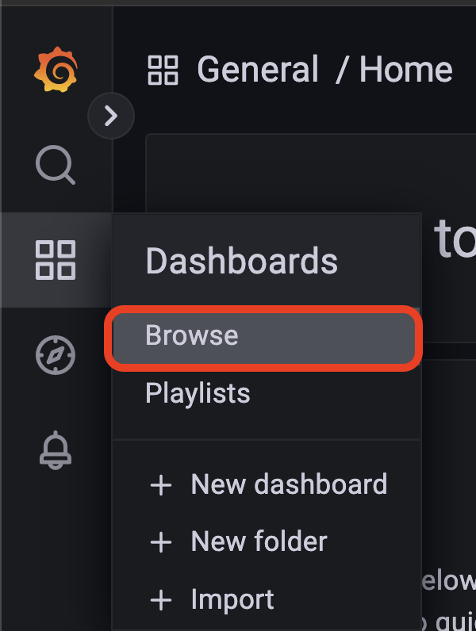
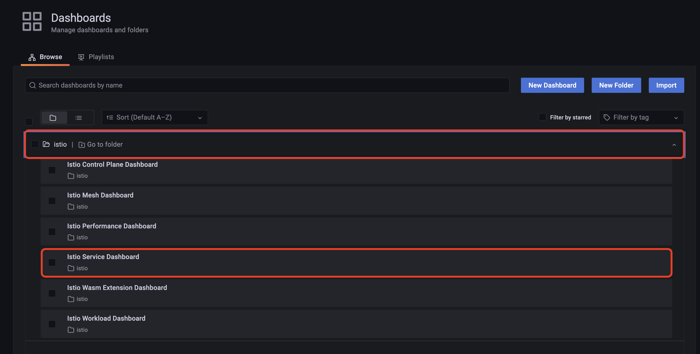
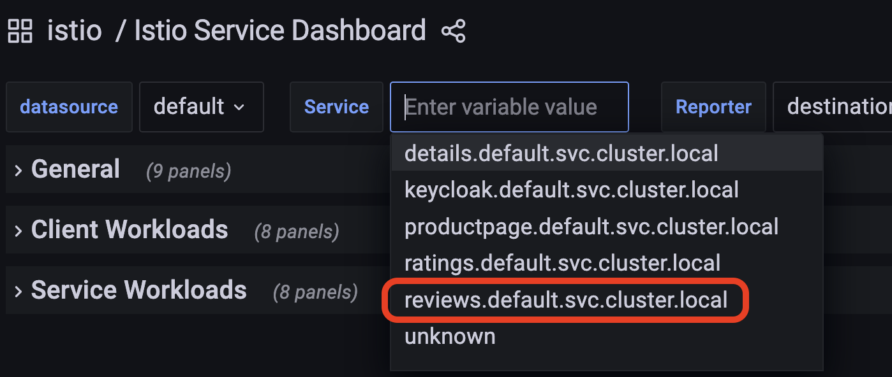
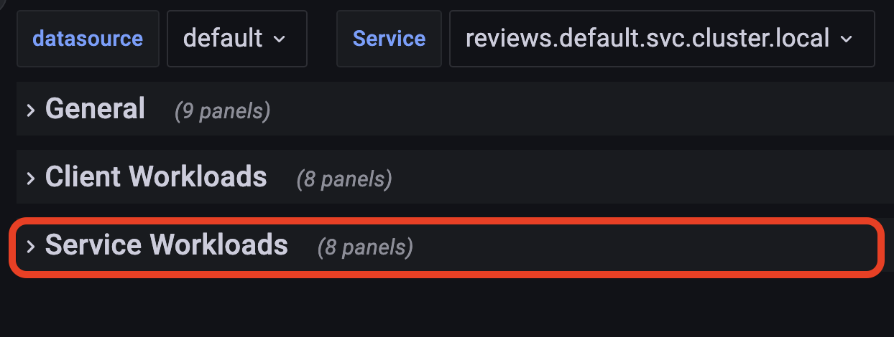
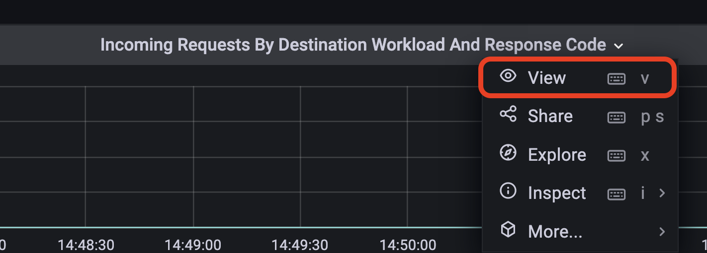
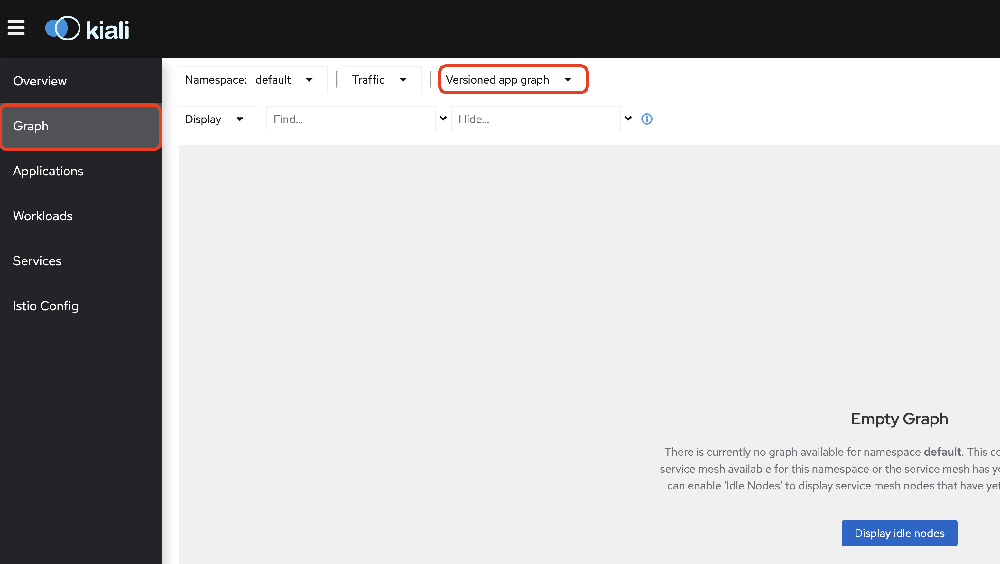
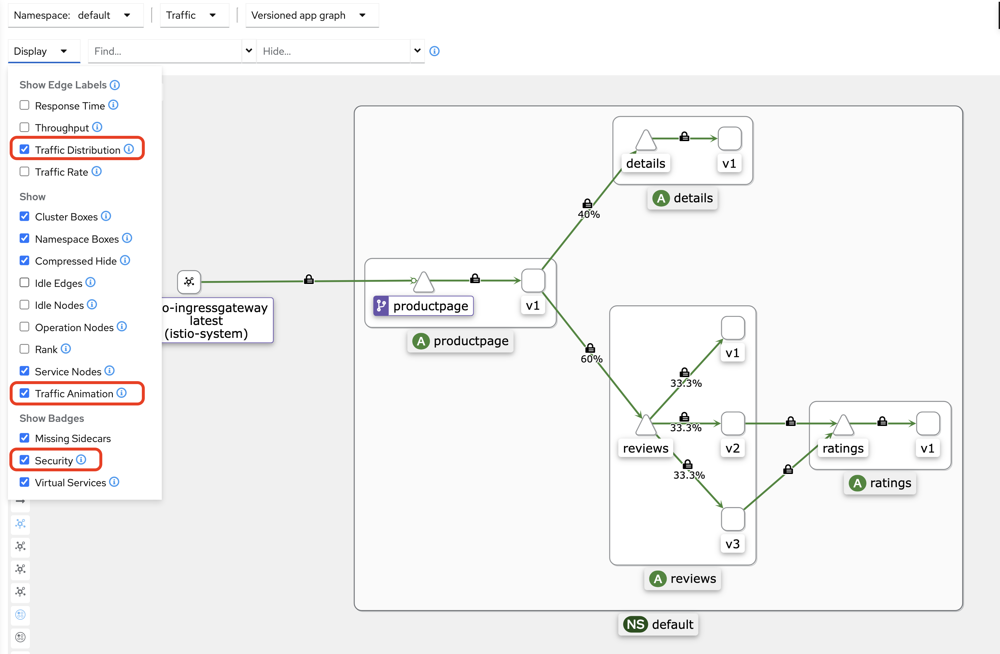
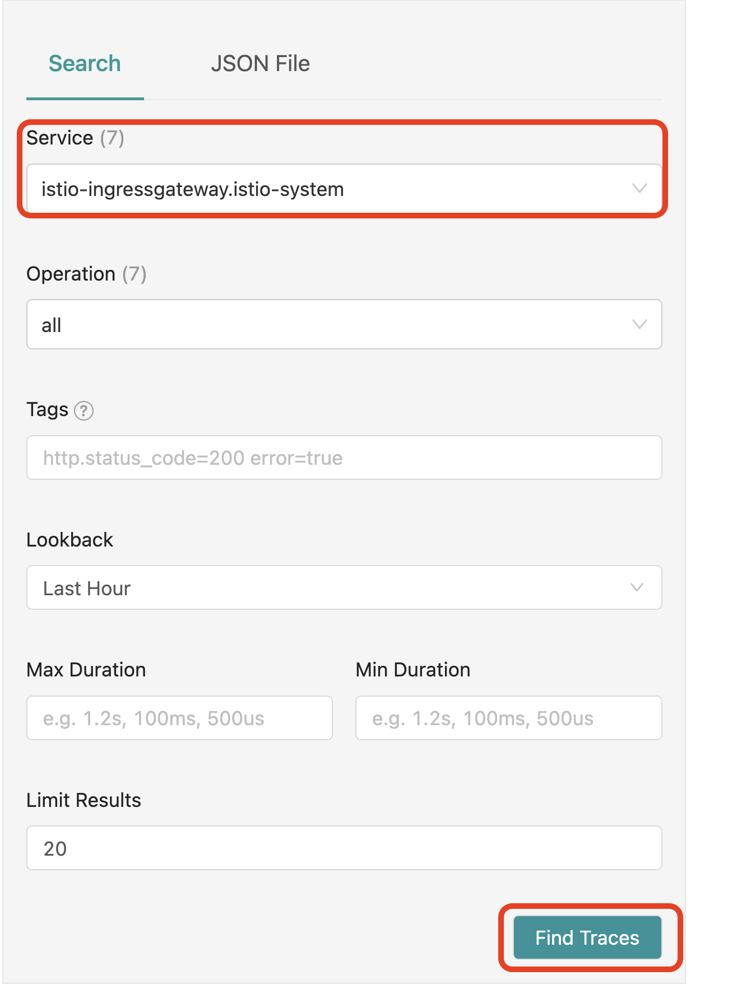
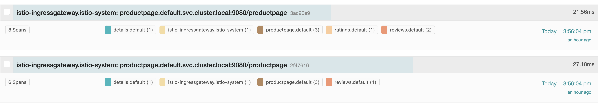
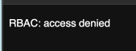

# ochacafe_servicemesh_istio

[OCHaCafe Season6 #1「Service Meshがっつり入門」](https://ochacafe.connpass.com/event/252270/)のデモ資材

## 1.Istioのインストール

今回はOracle Container Engine for Kubernetes(以下、OKE)環境でのIstioインストール手順とします。

### 1-1. OKEの構築

OKEの構築については[こちら](https://oracle-japan.github.io/ocitutorials/cloud-native/oke-for-advances/#1-1-ociダッシュボードからokeクラスタの構築)の手順を実施してください。手順1-1のみで問題ありません。

なお、上記手順では、Cloud ShellをクライアントとしてOKEを操作していますが、後続の手順のために別途VMもしくはComputeインスタンスをクライアントとすることを推奨します。

### 1-2. Istioのインストール

以下のコマンドを実行し、Istioのバージョンを定義しておきます。
今回は2022/9時点で最新の`1.15.0`を利用します。

```sh
ISTIO_VERSION=1.15.0
```

以下のコマンドを実行し、`istioctl`をダウンロードします。
`ISTIO_VERSION="${ISTIO_VERSION}"`部分を省略するとその時点での最新のバージョンがダウンロードされます。  

```sh
curl -L https://istio.io/downloadIstio | ISTIO_VERSION="${ISTIO_VERSION}" sh -
```

ダウンロードが成功したら、PATHを通しておきます。

```sh
export PATH="${PWD}/istio-${ISTIO_VERSION}/bin:${PATH}"
```

以下のコマンドで`istioctl`が機能することを確認します。

```sh
istioctl version
```

以下のように表示されればOKです。

```sh
no running Istio pods in "istio-system"
1.15.0
```

Istioをインストールします。

```sh
istioctl install --set profile=demo --skip-confirmation
```

以下のようになればインストール完了です。

```sh
✔ Istio core installed                                                                                                                           
✔ Istiod installed                                                                                                                               
✔ Egress gateways installed                                                                                                                      
✔ Ingress gateways installed                                                                                                                     
✔ Installation complete                                                                                                                          
Thank you for installing Istio 1.15.  Please take a few minutes to tell us about your install/upgrade experience!  https://forms.gle/kWULBRjUv7hHci7T6
```

Observabilityに必要なPrometheus/Grafana/Jarger/Kialiをインストールします。  

```sh
kubectl apply -f "istio-${ISTIO_VERSION}/samples/addons/"
```

最後にサイドカープロキシであるEnvoyが自動的にPodに注入されるようにラベリングを行います。  

```sh
kubectl label namespace default istio-injection=enabled
```

これでIstioのインストールは完了です。  

## 2.サンプルアプリケーションのインストール

ここでは、サンプルアプリケーションであるBookInfoアプリケーションをインストールします。  

以下のコマンドを叩くだけです!!

```sh
kubectl apply -f "istio-${ISTIO_VERSION}/samples/bookinfo/platform/kube/bookinfo.yaml"
```

サンプルアプリケーションが起動していることを確認するために以下のコマンドを実行します。  

```sh
kubectl get pods
```

この時、Istioが自動的にサイドカープロキシとしてEnvoyを注入します。  

```sh
[opc@oci-tutorials-env kube]$ k get pods
NAME                              READY   STATUS    RESTARTS   AGE
details-v1-78fdb449c4-2wrg2       2/2     Running   0          2m
productpage-v1-69bc959bc8-bf6zn   2/2     Running   0          2m
ratings-v1-5954c798-b4k5f         2/2     Running   0          2m
reviews-v1-59869f6d68-mpkpb       2/2     Running   0          2m
reviews-v2-7dcfbb45d-6nstd        2/2     Running   0          2m
reviews-v3-78f9f4c5dd-lj2sx       2/2     Running   0          2m
```

サンプルアプリケーションにアクセスはIstio Ingress Gateway経由で行います。

```sh
kubectl get svc istio-ingressgateway -n istio-system
```

```sh
NAME                   TYPE           CLUSTER-IP     EXTERNAL-IP   PORT(S)                                                                      AGE
istio-ingressgateway   LoadBalancer   10.96.248.85   xxx.xxx.xxx.xxx   15021:30664/TCP,80:30882/TCP,443:30082/TCP,31400:31426/TCP,15443:32294/TCP   3h
```

`xxx.xxx.xxx.xxx`で表示されるIPアドレスでサンプルアプリケーションにブラウザからアクセスできます。  

これでサンプルアプリケーションのインストールは完了です。  

## 3.Istioでいろいろ遊んでみる

ここから実際にIstioを使って遊んでみます。  

### 3-1. トラフィック制御を体感しよう

ここでは、トラフィックを制御してみます。  

はじめに、DestinationRuleを適用し、サブセットを作成します。  

```sh
kubectl apply -f manifest/destination_rule.yaml
``` 

最初に、reviewサービスをv1のみにルーティングしてみます。
以下のコマンドを実行します。  

```sh
kubectl apply -f manifest/01_traffic_management&O11y/traffic-100-0-0.yaml
```

実行後にブラウザからサンプルアプリケーションにアクセスすると、reviewサービスのv1のみにアクセスできることが確認できます。  

次に、reviewサービスをv2:v3=50:50の割合でルーティングしてみます。
以下のコマンドを実行します。  

```sh
kubectl apply -f manifest/01_traffic_management&O11y/traffic-0-50-50.yaml
```

実行後にブラウザからサンプルアプリケーションにアクセスすると、reviewサービスのv2とv3に半々ずつルーティングされることが確認できます。  

最後にreviewサービスをv1:v2:v3=80:10:10の割合でルーティングしてみます。  
以下のコマンドを実行します。  

```sh
kubectl apply -f manifest/01_traffic_management&O11y/traffic-80-10-10.yaml
```

実行後にブラウザからサンプルアプリケーションにアクセスすると、大半のトラフィックがreviewサービスのv1にルーティングされ、稀にv2とv3にルーティングされることが確認できます。

これでトラフィック制御については終わりです。

### 3-2.Observabilityを体感しよう

ここでは、先ほどのトラフィック制御の様子をObservabilityで体感してみます。

#### 3-2-1.Grafana(Prometheus)

まずは、Grafanaからメトリクスベースで確認します。  
以下のコマンドを実行し、ローカルにポートフォワードします。  

```sh
istioctl dashboard grafana
```

以下のように表示されるので、転送されたローカルポートにアクセスします。  

```sh
[opc@client demo]$ istioctl dashboard grafana
http://localhost:39049
```

左側にあるサイドメニューから`Bwowse`をクリックします。  



`istio`フォルダにある`Istio Service Dashboard`をクリックします。  


上部の`Service`から`reviews.default.svc.cluster.local`をクリックします。  


`Service Workloads`をクリックします。  


`Incoming Requests By Destination Workload And Response`のプルダウンから`View`をクリックすることでグラフを拡大できます。


このグラフによって、reviewサービスのバージョンごとのopsを確認できます。

#### 3-2-2.Kiali

次に、Kialiからメッシュ内のアプリケーションを確認します。  
以下のコマンドを実行し、ローカルにポートフォワードします。  

```sh
istioctl dashboard kiali
```

以下のように表示されるので、転送されたローカルポートにアクセスします。  

```sh
[opc@client demo]$ istioctl dashboard kiali
http://localhost:39049
```

KialiのUIが表示されたら、左側にあるサイドメニューの`Graph`の`Versioned app graph`を選択します。



場合によって、右上にあるタブから可視化する直近時間と更新タイミングを変更します。


`Display`タブにある`Traffic Distribution`(トラフィック分散状況)、`Traffic Animation`(トラフィックが流れている様子)、`Security`(通信がmTLSされているかどうか)にチェックを入れると、メッシュ内の状況が可視化できます。



これによって、サービスメッシュ内の状況を可視化できます。

#### 3-2-3.Jaeger

最後にJaegerを利用して、トレーシング情報を可視化します。  
以下のコマンドを実行し、ローカルにポートフォワードします。  

```sh
istioctl dashboard jaeger
```

以下のように表示されるので、転送されたローカルポートにアクセスします。  

```sh
[opc@client demo]$ istioctl dashboard jaeger
http://localhost:16686
```

Jaegerの画面が表示されたら、`Service`に`istio-ingressgaterway.istio-system`を選択し、`Find Traces`をクリックします。



reviewサービスのv1およびv2/v3のトレーシング含めた一覧が表示されます。
クリックすると詳細を確認できます。



以上でObservabilityを体感しようは終了です。

### 3-3.コネクションプールを体感してみよう

ここでは、Istioを利用したコネクションプールを体感してみます。

まずは、[こちら](https://k6.io/docs/getting-started/installation/)を参考にk6をローカルにインストールします。

以下のコマンドを実行します。  

```sh
./script/k6.sh
```

以下のように、全てのリクエストが成功するのが確認できます。

```sh
[opc@client demo]$ ./k6.sh 

          /\      |‾‾| /‾‾/   /‾‾/   
     /\  /  \     |  |/  /   /  /    
    /  \/    \    |     (   /   ‾‾\  
   /          \   |  |\  \ |  (‾)  | 
  / __________ \  |__| \__\ \_____/ .io

  execution: local
     script: k6/stress.js
     output: -

  scenarios: (100.00%) 1 scenario, 10 max VUs, 40s max duration (incl. graceful stop):
           * default: 10 looping VUs for 10s (gracefulStop: 30s)


running (10.1s), 00/10 VUs, 945 complete and 0 interrupted iterations
default ✓ [======================================] 10 VUs  10s

     ✓ response code was 200
     ✗ response code was 503
      ↳  0% — ✓ 0 / ✗ 945

     checks.........................: 50.00% ✓ 945       ✗ 945 
     data_received..................: 4.8 MB 478 kB/s
     data_sent......................: 83 kB  8.2 kB/s
     http_req_blocked...............: avg=648.47µs min=1.02µs  med=1.88µs   max=81.07ms  p(90)=2.51µs   p(95)=3.03µs  
     http_req_connecting............: avg=644.96µs min=0s      med=0s       max=80.94ms  p(90)=0s       p(95)=0s      
     http_req_duration..............: avg=105.77ms min=65.31ms med=100.51ms max=182.34ms p(90)=136.66ms p(95)=144.24ms
       { expected_response:true }...: avg=105.77ms min=65.31ms med=100.51ms max=182.34ms p(90)=136.66ms p(95)=144.24ms
     http_req_failed................: 0.00%  ✓ 0         ✗ 945 
     http_req_receiving.............: avg=489.16µs min=22.54µs med=58.26µs  max=6.12ms   p(90)=1.5ms    p(95)=2.24ms  
     http_req_sending...............: avg=10.53µs  min=4.85µs  med=8.72µs   max=112.15µs p(90)=14.02µs  p(95)=18.05µs 
     http_req_tls_handshaking.......: avg=0s       min=0s      med=0s       max=0s       p(90)=0s       p(95)=0s      
     http_req_waiting...............: avg=105.27ms min=65.28ms med=99.55ms  max=180.79ms p(90)=136.17ms p(95)=143.86ms
     http_reqs......................: 945    93.347664/s
     iteration_duration.............: avg=106.5ms  min=65.37ms med=100.6ms  max=243.99ms p(90)=137.56ms p(95)=146.04ms
     iterations.....................: 945    93.347664/s
     vus............................: 10     min=10      max=10
     vus_max........................: 10     min=10      max=10
```

次にコネクションプールを作成します。  
以下のコマンドを実行します。

```sh
kubectl apply -f 02_resillience/resillience.yaml
```

その後、再度負荷テストを実行します。  

```sh
./script/k6.sh
```

以下のように、設定したコネクションプールによって、半数程度のリクエストが失敗することを確認できます。  
これによって、大量のトラフィックによりサービスダウンが発生することを防止することができます。

```sh
[opc@client demo]$ ./k6.sh 

          /\      |‾‾| /‾‾/   /‾‾/   
     /\  /  \     |  |/  /   /  /    
    /  \/    \    |     (   /   ‾‾\  
   /          \   |  |\  \ |  (‾)  | 
  / __________ \  |__| \__\ \_____/ .io

  execution: local
     script: k6/stress.js
     output: -

  scenarios: (100.00%) 1 scenario, 10 max VUs, 40s max duration (incl. graceful stop):
           * default: 10 looping VUs for 10s (gracefulStop: 30s)


running (10.1s), 00/10 VUs, 1041 complete and 0 interrupted iterations
default ✓ [======================================] 10 VUs  10s

     ✗ response code was 200
      ↳  39% — ✓ 407 / ✗ 634
     ✗ response code was 503
      ↳  60% — ✓ 634 / ✗ 407

     checks.........................: 50.00% ✓ 1041       ✗ 1041
     data_received..................: 2.2 MB 222 kB/s
     data_sent......................: 92 kB  9.0 kB/s
     http_req_blocked...............: avg=618.04µs min=1.04µs  med=1.93µs   max=103.13ms p(90)=2.56µs   p(95)=3.07µs  
     http_req_connecting............: avg=615.24µs min=0s      med=0s       max=103.07ms p(90)=0s       p(95)=0s      
     http_req_duration..............: avg=95.9ms   min=55.67ms med=84.67ms  max=247.04ms p(90)=148.98ms p(95)=162.15ms
       { expected_response:true }...: avg=128.82ms min=71.96ms med=129.55ms max=247.04ms p(90)=168.06ms p(95)=183.18ms
     http_req_failed................: 60.90% ✓ 634        ✗ 407 
     http_req_receiving.............: avg=56.78µs  min=15.51µs med=40.59µs  max=1.55ms   p(90)=69.8µs   p(95)=86.95µs 
     http_req_sending...............: avg=11.9µs   min=4.72µs  med=9.45µs   max=237.94µs p(90)=14.54µs  p(95)=20.26µs 
     http_req_tls_handshaking.......: avg=0s       min=0s      med=0s       max=0s       p(90)=0s       p(95)=0s      
     http_req_waiting...............: avg=95.83ms  min=55.64ms med=84.59ms  max=246.98ms p(90)=148.86ms p(95)=162.08ms
     http_reqs......................: 1041   102.730768/s
     iteration_duration.............: avg=96.61ms  min=55.74ms med=85.27ms  max=285.48ms p(90)=149.44ms p(95)=162.92ms
     iterations.....................: 1041   102.730768/s
     vus............................: 10     min=10       max=10
     vus_max........................: 10     min=10       max=10
```

### 3-4.認証認可を体感してみよう

ここでは、Istioでの認証認可を体感してみます。  
これには、何らかのIDaaSが必要になるため、あらかじめ用意しておきます。  

以下のようなManifestを`03_auth/auth.yaml`に用意しています。
```yaml
apiVersion: security.istio.io/v1beta1
kind: RequestAuthentication
metadata:
  name: demo-authentication
spec:
  # selector:
  #   matchLabels:
  #     app: productpage 
  jwtRules: 
  - issuer: "xxxxxxx"  # IDaaSのissuer
    jwksUri: "xxxxxxxxx"  # IDaaSのjwks url
    forwardOriginalToken: true # JWTの伝播
---
apiVersion: security.istio.io/v1beta1
kind: AuthorizationPolicy
metadata:
  name: demo-authorization
spec:
  # selector:
  #   matchLabels:
  #     app: productpage
  rules: 
    - from:
      - source:
          requestPrincipals: ["xxxxxx/xxxxxx"] # issuer/subject
      to:
      - operation:
          methods:
          - GET  # 許可するメソッド

```

`.spec.jwtRules`に利用するIDaaSのIssuerとJWKS URIを定義します。
OpenID Connect Discoveryが公開されていないIDaaSの場合は、以下のようにJWKSを直接定義可能です。

```yaml
  jwtRules: 
  - issuer: "xxxxxxx"  # IDaaSのissuer
    jwks: "{ keys:[ {e:AQAB,kid:DHFbpoIUqrY8txxxxxxxxxxxxxxxxxx...."  # IDaaSのjwks url
    forwardOriginalToken: true # JWTの伝播
```

また、以下の`.spec.rules.from[0].source[0].requestPrincipals`に認可するユーザを定義します。  
ここでは、IDaaSの`issuer`と`subject`を定義します。  

```yaml
  rules: 
    - from:
      - source:
          requestPrincipals: ["xxxxxx/xxxxxx"] # issuer/subject
```

Manifestを適用します。  

```sh
kubectl apply -f 03_auth/auth.yaml
```

適用後にサンプルアプリケーションにアクセスすると、以下のようにアクセスが拒否されます。  



Chromeなどの拡張機能でHeaderを付与できるプラグインを利用して、JWTを付与してアクセスすると再度アクセスできます。
プラグインには[modheader](https://modheader.com/)などがあります。  
